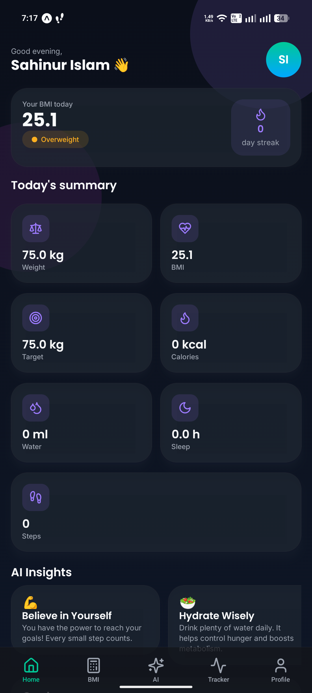
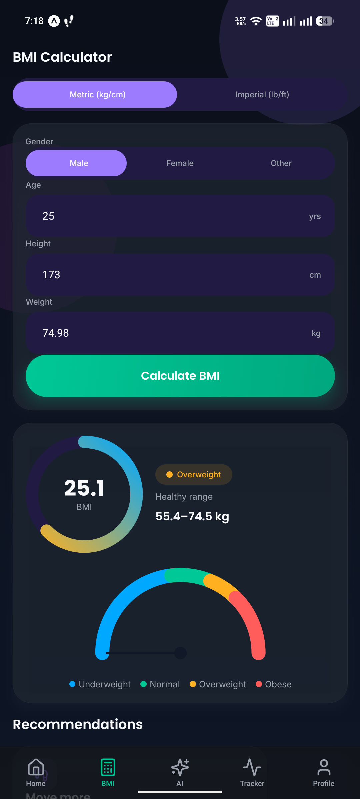
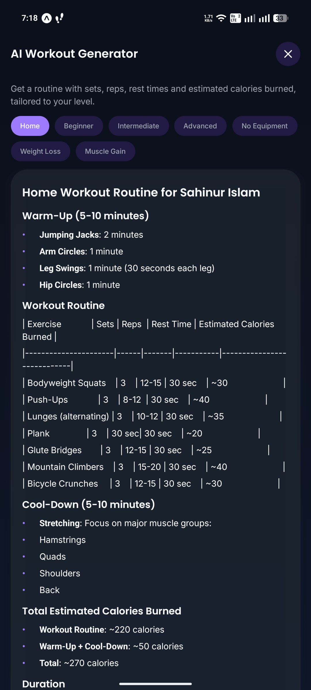
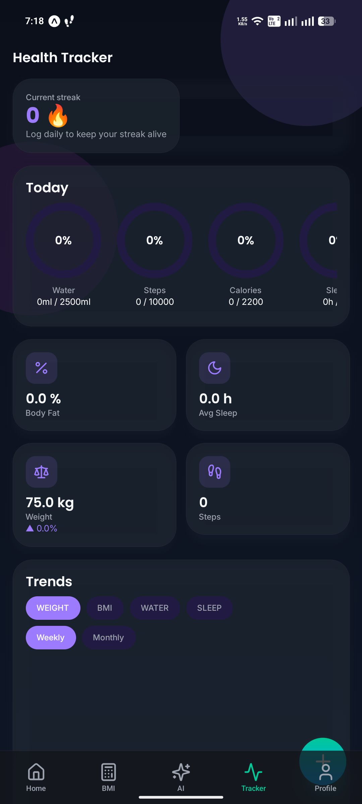
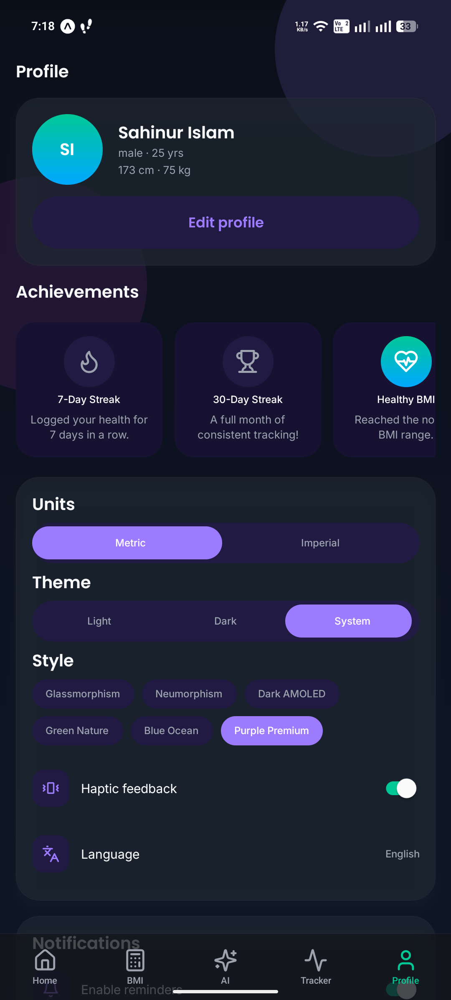

<div align="center">


# FitBMI — BMI Calculator &amp; AI Health Coach

**A modern, privacy-first health app built with React Native &amp; Expo.**
BMI calculator · AI health coach · live step / water / sleep tracking ·
gamification · 6 themes · 7 languages — all **offline, no account, your data
stays on your device.**

[](https://expo.dev)
[](https://reactnative.dev)
[](https://www.typescriptlang.org)
[](./LICENSE)
[](./CONTRIBUTING.md)

[**Live landing page**](https://devsahinur.github.io/FitBMI/) ·
[Privacy](docs/privacy.html) · [Publishing guide](./PUBLISHING.md) ·
[Contributing](./CONTRIBUTING.md)

</div>

<p align="center">
  
  
  
  
  
</p>

> ⚕️ This app is for general fitness and wellness purposes only and does **not**
> provide medical advice. AI responses are informational only.

---

## ✨ Features

- **BMI Calculator** — metric/imperial, animated gauge, color-coded categories,
  healthy range, recommendation cards, confetti for a healthy result.
- **AI Health Coach** — streaming chat (markdown, typing, avatars, history) plus
  meal-plan, workout, recipe, goal-planner and weekly-report generators.
- **Daily AI Insights** on the home screen.
- **Health Tracker** — **live step tracking** (device pedometer), weight, body
  fat, water, sleep, calories; progress rings + weekly/monthly charts.
- **Gamification** — XP, levels, coins, streaks, reward wheel, daily challenges,
  achievements, confetti.
- **Onboarding** that collects your profile on first launch.
- **Design** — glassmorphism, Light/Dark/AMOLED + 6 theme variants, Poppins +
  Inter, reduced-motion aware, 60fps animations.
- **i18n** — 7 languages (en, es, fr, de, ar, hi, bn).
- **Local-first** — AsyncStorage; no backend, no account; CSV/report export.

## 🧱 Tech Stack

React Native 0.81 · Expo SDK 54 · React 19 · TypeScript (strict) · Expo Router ·
NativeWind · Reanimated 4 · Moti · Zustand · React Query · React Hook Form ·
AsyncStorage · react-native-svg (charts) · @gorhom/bottom-sheet · i18next ·
expo-sensors · OpenRouter (AI) · Lucide icons · Google Fonts.

> Runs in **Expo Go (SDK 54)** — storage uses AsyncStorage and charts use SVG,
> both bundled in Expo Go, so no custom dev client is required.

## 🚀 Quick Start

```bash
git clone https://github.com/devSahinur/FitBMI.git
cd FitBMI
npm install --legacy-peer-deps

# (optional) enable AI features
cp .env.example .env        # add EXPO_PUBLIC_OPENROUTER_API_KEY

npm start                   # scan the QR with Expo Go, or press a / i / w
```

> `--legacy-peer-deps` is needed because a few RN libraries declare strict React
> peer ranges (a project `.npmrc` sets this automatically for CI/EAS).

### AI setup (optional)

AI features use [OpenRouter](https://openrouter.ai) with automatic fallback
across **free** models first (DeepSeek, Llama 3.3, Gemini Flash, Qwen) then
low-cost paid ones. Add a key to `.env`:

```
EXPO_PUBLIC_OPENROUTER_API_KEY=sk-or-...   # from https://openrouter.ai/keys
```

Without a key, AI screens degrade gracefully and the rest works fully.

## 📁 Project Structure

```
src/
  app/         Expo Router routes — (tabs), ai/, auth/, onboarding, premium, …
  components/  Reusable UI — ui/, ai/, auth/, charts/, gamification/, layout/
  screens/     Screen implementations
  features/    ai/ (prompts, types), food-scanner/, community/, bmi/
  hooks/       useTheme, useChat, useStepTracking, useReducedMotion, …
  store/       Zustand stores (persisted via AsyncStorage)
  services/    storage, openrouter, ai, pedometer, notifications, export, …
  i18n/        i18next + 7 locales
  theme/       colors, typography, spacing, shadows, variants
  utils/       bmi, units, format, date, stats, csv, xp
docs/          Landing page + hosted Privacy/Terms (GitHub Pages)
store/         Play Store assets (icon, feature graphic, screenshots)
e2e/           Detox scaffold
```

## 📜 Scripts

| Command | Description |
| --- | --- |
| `npm start` | Expo dev server |
| `npm test` | Jest unit tests |
| `npm run typecheck` | TypeScript (no emit) |
| `npm run lint` / `format` | ESLint / Prettier |

## 🧪 Testing

Jest unit tests (**44**) cover BMI math, unit conversions, date/streak helpers,
CSV, XP/levels, AI prompt builders, OpenRouter model-fallback (with `expo/fetch`
mocked), and the history + gamification stores. AsyncStorage is mocked.
A **Detox** e2e scaffold lives in `e2e/` (needs a native build).

```bash
npm test
```

## 🗺️ Roadmap

Some modules are built but intentionally disabled, ready to enable:

- [ ] Re-enable the History tab
- [ ] Community (leaderboard, friends, challenges) — `features/community`
- [ ] AI Food Scanner (camera + barcode) — `features/food-scanner`
- [ ] Real in-app purchases (premium architecture is ready)
- [ ] Background / Health Connect step tracking (dev build)
- [ ] Full per-screen i18n string coverage

## 🤝 Contributing

PRs welcome! Please read [CONTRIBUTING.md](./CONTRIBUTING.md) and make sure
`npm run typecheck`, `npm test` and `npm run lint` pass.

## 📦 Publishing

See [PUBLISHING.md](./PUBLISHING.md) for the full Google Play build &amp; submit
guide, Data Safety mapping, and ready-to-paste store listing copy.

## 📄 License

[MIT](./LICENSE) © 2026 **Sahinur** · [infosahinur@gmail.com](mailto:infosahinur@gmail.com)

Built with React Native &amp; Expo. Icons by [Lucide](https://lucide.dev),
fonts by [Google Fonts](https://fonts.google.com), AI via
[OpenRouter](https://openrouter.ai). Use only free, commercially-licensed assets
when contributing.
